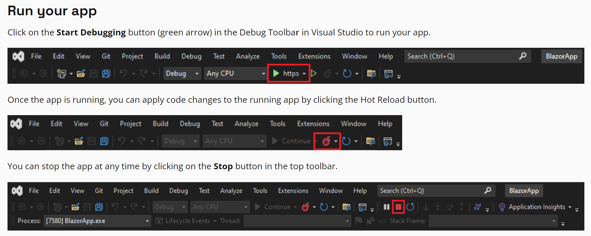

# CPSC 481 Project
## By Group 11 (Bryce Cayanan, Maram Elsayed, Osama Hameed, Jaide Porter, Jessica Tran)

## Instructions for running the application

### Prerequisites
You have to install Visual Studio 2022.\
Follow this link on how to install VS2022, or modify your already installed VS2022 to work with Blazor: https://dotnet.microsoft.com/en-us/learn/aspnet/blazor-tutorial/install


### Steps
1. Clone the repo onto your desktop by opening the command line
```
git clone https://github.com/J-essicaTran/CPSC-481-Project.git
```

2. Open the file ```CPSC 481 Project.sln``` in Visual Studio
3. Run and stop the application in Visual Studio by following the instructions in the following picture: 
